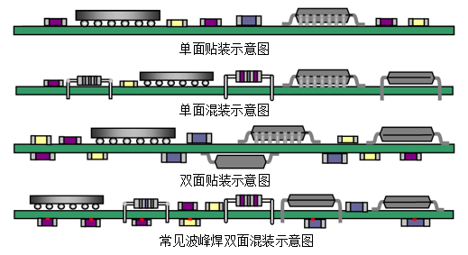

# PCB 堆叠与分层

虽然 PCB 可以分为多层结构进行设计，但是通常元器件仅能在顶层或者底层，分别通过波峰焊（针对贴片元件）或者回流焊（针对分立元件）进行焊接：

根据覆铜层数的不同，可以将 PCB 具体划分为如下 3 种类型：
1. 单面 PCB 板：仅有一面走线或者覆铜；
2. 双面 PCB 板：顶层和底层都会进行走线或者覆铜；
3. 多层 PCB 板：除了顶层和底层之外，中间还包含了`信号层`、`中间层`、`电源层`、`接地层`，每一层之间相互绝缘并采用过孔连接；
> 注意：因为双面 PCB 的电磁兼容性较差，所以通常仅用于低速设计当中。

每层 PCB 之间，分别可以采用`通孔`、`盲孔`、`埋孔`方式进行连接。总体而言，绝大多数板级 EDA 工具软件都定义有下表当中的 PCB 功能层次：
<table>
<colgroup>
<col style="width: 9%">
<col style="width: 90%">
</colgroup>
<thead>
<tr class="header">
<th style="text-align: center;">名称</th>
<th style="text-align: left;">描述</th>
</tr>
</thead>
<tbody>
<tr class="odd">
<td style="text-align: center;"><strong>顶层/底层</strong></td>
<td style="text-align: left;">PCB 板顶面、底面的铜箔层，用于信号走线。</td>
</tr>
<tr class="even">
<td style="text-align: center;"><strong>内层</strong></td>
<td style="text-align: left;">覆盖有铜箔，用于信号走线与铺铜，可以设置为信号层和内电层。</td>
</tr>
<tr class="odd">
<td style="text-align: center;"><strong>顶层/底层丝印层</strong></td>
<td style="text-align: left;">印刷在 PCB 板上的字符层（通常为白色）。</td>
</tr>
<tr class="even">
<td style="text-align: center;"><strong>顶层/底层锡膏层</strong></td>
<td style="text-align: left;">也称为正片工艺时的<strong>助焊层</strong>，用于为贴片焊盘制造不锈钢网使用的层，从而决定锡膏填充区域大小以辅助焊接，不需要贴片可以忽略该层；</td>
</tr>
<tr class="odd">
<td style="text-align: center;"><strong>顶层/底层阻焊层：</strong></td>
<td style="text-align: left;">PCB 顶层、底层上的盖油层（通常为绿色阻焊油），其作用是阻止焊锡粘结板材；该层为负片绘制方式，当有导线或区域不需要覆盖阻焊油时进行绘制，生产出的 PCB 相应区域将不会覆盖阻焊油，该操作通常称为<strong>开窗</strong>；</td>
</tr>
<tr class="even">
<td style="text-align: center;"><strong>边框层</strong></td>
<td style="text-align: left;">该层用于定义板框的形状、尺寸，板厂会基于该层进行 PCB 生产；</td>
</tr>
<tr class="odd">
<td style="text-align: center;"><strong>顶层/底层装配层</strong></td>
<td style="text-align: left;">元器件的简化轮廓，用于装配与维修，可以导出文档打印，不会对 PCB 板生产造成影响；</td>
</tr>
<tr class="even">
<td style="text-align: center;"><strong>机械层</strong></td>
<td style="text-align: left;">用于记录一些 PCB 板的机械信息，生产时默认不会使用该层定义的形状进行制造，某些板厂使用源文件生产时会采用机械层作为边框，使用 <code>Gerber</code> 文件生产时该层仅用于标识<code>工艺参数</code>、<code>V 割路径</code>等文字信息；</td>
</tr>
<tr class="odd">
<td style="text-align: center;"><strong>文档层</strong></td>
<td style="text-align: left;">类似于机械层，但是该层仅在 EDA 工具当中可见，不会导出至 <code>Gerber</code> 文件当中；</td>
</tr>
<tr class="even">
<td style="text-align: center;"><strong>飞线层</strong></td>
<td style="text-align: left;">显示 PCB 网络飞线，不属于物理意义上的层，只是为了方便颜色设置，因此某些 EDA 工具会将其放置到<code>层管理器</code>当中进行配置；</td>
</tr>
<tr class="odd">
<td style="text-align: center;"><strong>孔层</strong></td>
<td style="text-align: left;">类似于飞线层，不属于物理意义上的层，仅用于<strong>通孔</strong>（非金属化孔）的显示与颜色配置使用；</td>
</tr>
<tr class="even">
<td style="text-align: center;"><strong>多层</strong></td>
<td style="text-align: left;">类似于飞线层，金属化孔的显示和颜色配置，当焊盘层属性为多层时，该层将用于连接包括内层在内的每个铜箔层；</td>
</tr>
<tr class="odd">
<td style="text-align: center;"><strong>错误层</strong></td>
<td style="text-align: left;">类似于飞线层，用于 DRC（设计规则检验）的错误标识显示与颜色配置；</td>
</tr>
</tbody>
</table>

> 注意：信号层主要放置铜膜导线与元件，为电气信号提供传输通道；内部电源/接地层 也称为内电层，主要用来铺设电源和接地，由大块的铜膜覆盖而成，可以提升 PCB 工作的稳定性。

<table>
<thead>
<tr class="header">
<th style="text-align: center;">板层顺序</th>
<th style="text-align: center;">第 1 层</th>
<th style="text-align: center;">第 2 层</th>
<th style="text-align: center;">第 3 层</th>
<th style="text-align: center;">第 4 层</th>
</tr>
</thead>
<tbody>
<tr class="odd">
<td style="text-align: center;"><strong>第 1 种情况</strong></td>
<td style="text-align: center;">接地层</td>
<td style="text-align: center;">（信号 1 + 电源）</td>
<td style="text-align: center;">（信号 2 + 电源）</td>
<td style="text-align: center;">接地</td>
</tr>
<tr class="even">
<td style="text-align: center;"><strong>第 2 种情况</strong></td>
<td style="text-align: center;">信号 1</td>
<td style="text-align: center;">接地层</td>
<td style="text-align: center;">电源层</td>
<td style="text-align: center;">信号 2</td>
</tr>
<tr class="odd">
<td style="text-align: center;"><strong>第 3 种情况</strong></td>
<td style="text-align: center;">接地层</td>
<td style="text-align: center;">信号 1</td>
<td style="text-align: center;">信号 2</td>
<td style="text-align: center;">电源层</td>
</tr>
</tbody>
</table>

第 1 种情况，比较理想的四层板堆叠设计，因为最外层是接地层，对于 EMI 有屏蔽作用，同时电源层与接地层可以靠得很近，使得电源内阻较小；但是，当元器件密度比较大时，不能保证接地层的完整性，信号层的信号质量会变得较差，相邻信号层之间的串扰较大；
第 2 种情况，这种方式较为常用，这种结构拥有较好的层电容效应，整个 PCB 的层间串扰较小，信号层可以取得较好的信号完整性；但这种结构当中，由于信号层处于表层，空间电磁辐射的强度增大，需要通过外加屏蔽壳才能够降低 EMI；
第 3 种情况，电源层与接地层都处于表层，信号完整性比较好，其中 信号 1 层上的信号质量最好，信号 2 层次之；这种设计对于 EMI 有一定的屏蔽作用；但是，由于环路较大，器件密度的大小直接决定着信号质量，相邻信号层不能避免层间干扰，整体上不如第 1 种结构，除非对于电源功率有特殊要求；
六层 PCB 参考设计

<table>
<thead>
<tr class="header">
<th style="text-align: center;">板层顺序</th>
<th style="text-align: center;">第 1 层</th>
<th style="text-align: center;">第 2 层</th>
<th style="text-align: center;">第 3 层</th>
<th style="text-align: center;">第 4 层</th>
<th style="text-align: center;">第 5 层</th>
<th style="text-align: center;">第 6 层</th>
</tr>
</thead>
<tbody>
<tr class="odd">
<td style="text-align: center;"><strong>第 1 种情况</strong></td>
<td style="text-align: center;">信号 1</td>
<td style="text-align: center;">接地层</td>
<td style="text-align: center;">信号 2</td>
<td style="text-align: center;">信号 3</td>
<td style="text-align: center;">电源层</td>
<td style="text-align: center;">信号 4</td>
</tr>
<tr class="even">
<td style="text-align: center;"><strong>第 2 种情况</strong></td>
<td style="text-align: center;">信号 1</td>
<td style="text-align: center;">信号 2</td>
<td style="text-align: center;">接地层</td>
<td style="text-align: center;">电源层</td>
<td style="text-align: center;">信号 3</td>
<td style="text-align: center;">信号 4</td>
</tr>
<tr class="odd">
<td style="text-align: center;"><strong>第 3 种情况</strong></td>
<td style="text-align: center;">信号 1</td>
<td style="text-align: center;">接地层</td>
<td style="text-align: center;">信号 2</td>
<td style="text-align: center;">电源层</td>
<td style="text-align: center;">信号 3</td>
<td style="text-align: center;">信号 4</td>
</tr>
<tr class="even">
<td style="text-align: center;"><strong>第 4 种情况</strong></td>
<td style="text-align: center;">接地层</td>
<td style="text-align: center;">信号 1</td>
<td style="text-align: center;">电源层</td>
<td style="text-align: center;">接地层</td>
<td style="text-align: center;">信号 2</td>
<td style="text-align: center;">接地层</td>
</tr>
</tbody>
</table>

第 1 种情况，是常见的方式之一，信号 1 层是比较好的布线层，信号 2 层次之；但是要注意 信号 2 与 信号 3 之间的层间串扰，信号 4 如果没有元件，就尽量减少信号线，并且多覆盖一层接地；
第 2 种情况，信号 2 与 信号 3层的信号完整性最好，其中 信号 2 层为最好的布线层，信号 3 层次之；电源平面的阻抗较好，层间电容较大，有利于抑制整板的 EMI；但是由于 信号 1 与 信号 2 之间存在较大的层间干扰，并且距离电源层和接地层较远，EMI 空间辐射强度较大，可能需要外加屏蔽壳；
第 3 种情况，这种情况是六层板的最佳布局，信号 1、信号 2、信号 3 都是比较好的布线层，并且电源平面的阻抗也比较好，美中不足之处在于 信号 4 距离接地层过远；
第 4 种情况，虽然性能优于前面 3 种，但是可供布线的层数仅有 2 层；